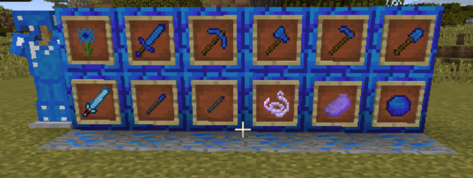
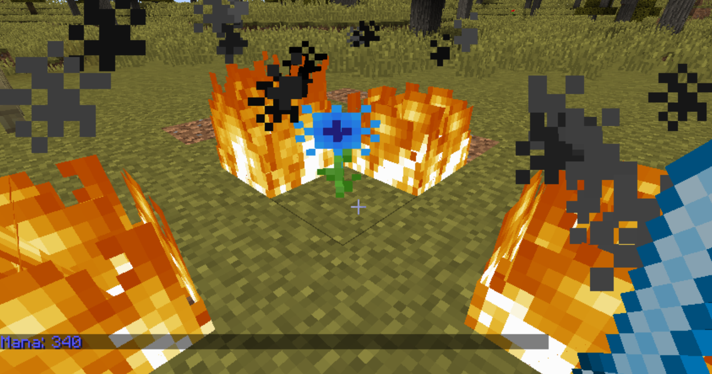
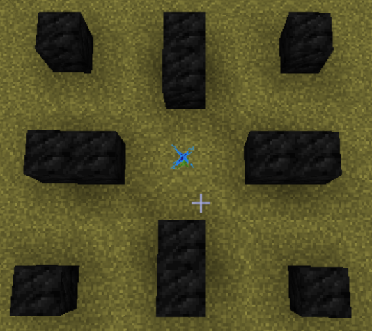
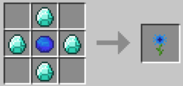
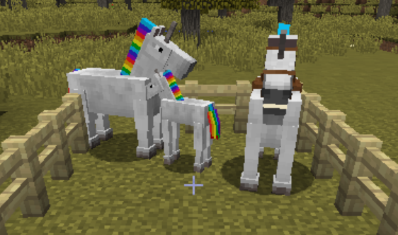
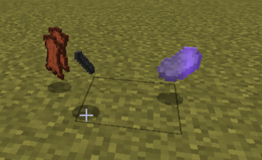
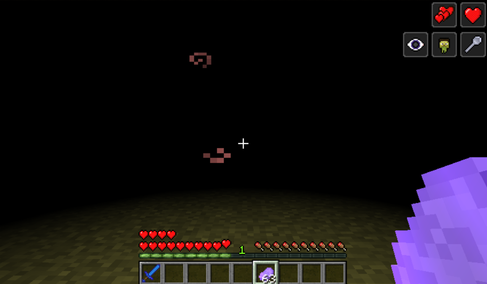
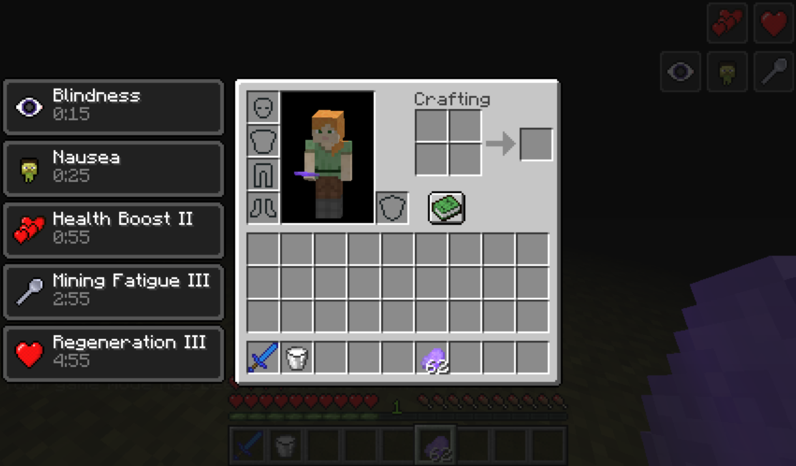
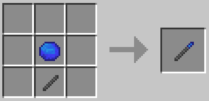
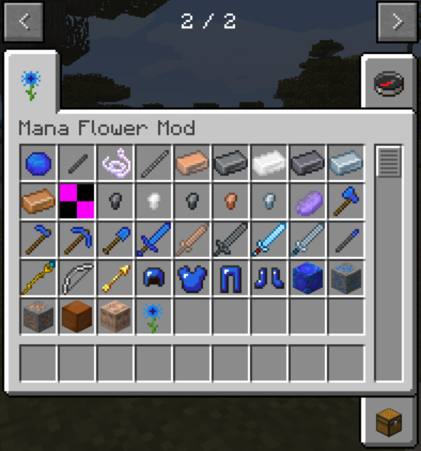

## Advanced Programming Project 3 - Minecraft Mod

Minecraft mod using Forge for Minecraft 1.12.2.

Coded in collaboration with GitHub user FrenzyExists.

Special thanks to YouTube users Harry Talks and TechnoVision; their videos helped me
understand the more intracate parts of Minecraft's code. I recomend their videos if you're
intrested in learning to create Minecraft mods.

 
 
 

This mod adds the sapphire material, along with its tools and armor.
All their recepies are the same as with the other materials.
The sapphire ore spawnns on level 5-25 in groups of 5-10.

 
 
 

The main feature of this mod is the Mana Flower. Its a flower that creates mana by burning
near coal blocks when you right click it, for every coal block it gains 20 mana. You can then 
transfer the mana to the Mana Sword by shift+rightClicking the mana flower with the sword in hand.
The sword deals more damage the more mana it has stored, for every hit it looses 1 mana.

 

The Mana Flower will absorb coal blocks within a 3 block radius.

 

The Mana Flower is crafted using 4 diamonds and a sapphire.

 
 
 

The other main feature of this mod is the addition of unicorns. They behave like horses in the sense
that you can tame them and ride them, but unicorns are noble creatures that are not to be taken into battle,
so they cannot wear armor. You can breed unicors with golden apples; when you breed two unicorns you always
get another unicorn, but when you breed a unicorn with a horse, donkey or mule, you have a 80% chance of 
producing a horse and a 20% of producing a unicorn. You can obtain unicorn hair by using shears.

 

If you were to commit the atrocity of murdering a unicorn, you would obtain 1 unicorn horn, 1-3 piece(s) of
unicorn meat, and 1-2 piece(s) of leather.

 

 
 
*"It is a terrible crime to slay a unicorn, drinking the blood of a unicorn will keep you alive even if you are 
an inch from death, but at a terrible price" [-Firenze (Harry Potter and the Philosopher's Stone), JK Rowling]*

Eating unicorn meat has strong healing effects, but they come at a terrible price.
#### Unicorn Meat Effects:
* Bilndness - 20 seconds
* Nausea - 30 seconds
* Health Boost II - 1 minute
* Mining Fatigue III - 3 minutes
* Regeneration III - 5 minutes

 

 

Using a unicorn horn and a sapphire you can craft a wand that shoots fire balls and sets blocks on fire
in the same way a flint & steel would.

 
 

 
Additional items in the mod, items that where not covered in this "read me" where created by GitHub user FrenzyExists.

 
  
 

 ###### The textures for all the sapphire items, the mana flower, all the unicorn items and the unicorn model were all drawn by me.
